 

---

### `> whoami`

  

---

### `> system.status`

| Module | Status |
|:--|:--|
| 🛰️ **Current focus** | Resilient, low-latency APIs and integrations |
| 🧬 **Exploring** | Platform engineering, Internal Developer Platforms, DevEx |
| 🤖 **AI lab** | LLM integration in backend systems, agents and automation |
| 📚 **Learning** | Microsoft certifications · Cloud-native architecture |
| ⚡ **Fun fact** | Coffee in, code out ☕ → 💻 |

---

### `> tech.stack --all`

  

  

---

### `> render --contributions`

<picture>
  <source media="(prefers-color-scheme: dark)" srcset="https://raw.githubusercontent.com/joaobrunomf/joaobrunomf/output/github-snake-dark.svg" />
  <source media="(prefers-color-scheme: light)" srcset="https://raw.githubusercontent.com/joaobrunomf/joaobrunomf/output/github-snake.svg" />
  
</picture>

---

### `> connect --secure`

